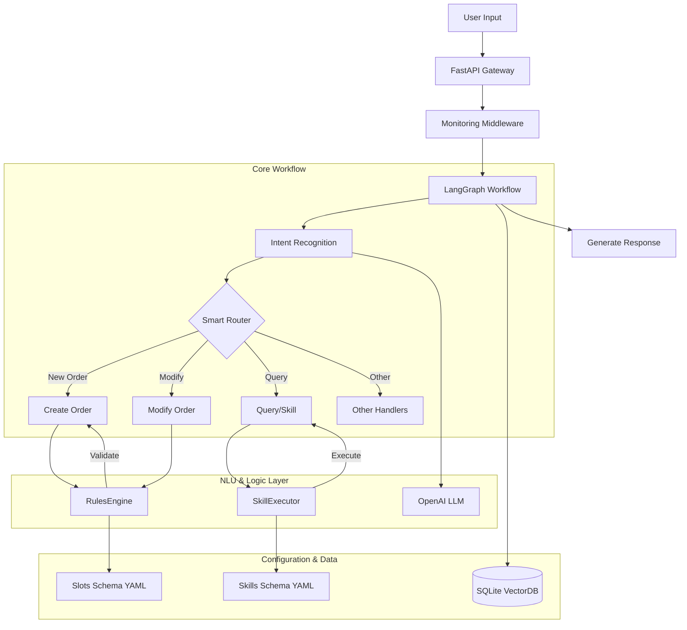

# AI 咖啡点单意图识别系统 (AIChatOrder)

基于大语言模型（LLM）的智能咖啡店点单系统。本项目演示了如何构建一个生产级质量的 AI Agent，涵盖了多轮对话管理、意图识别、复杂槽位提取、业务规则引擎、技能执行以及全链路监控。

## 🌟 核心特性

*   **🧠 智能对话管理 (LangGraph)**: 采用 LangGraph 构建状态机工作流，支持上下文保持、状态持久化 (SQLite) 和复杂的对话分支。
*   **🎯 多策略意图识别**: 支持 Zero-shot, Few-shot, RAG (检索增强), Function Calling 四种分类方法，可动态切换。
*   **🛠️ 强大的规则引擎 (Phase 1)**:
    *   **模糊表达匹配**: 支持"不要那么甜"（半糖）、"续命水"（美式）等口语化表达。
    *   **组合约束验证**: 自动校验产品规则（如"星冰乐不能做热的"）并自动修正。
    *   **增强槽位标准化**: 支持模糊匹配和别名映射（如"澳白" -> "馥芮白"）。
*   **🧩 可扩展技能系统 (Skills)**: 类似 Claude Skill 的插件化架构，内置库存查询、营养分析、智能推荐、优惠券等 8 种技能，通过 YAML 配置驱动。
*   **📊 全链路监控**: 内置结构化日志、性能指标收集 (Metrics) 和请求追踪 (Request ID)。
*   **⚙️ 现代化配置**: 基于 Pydantic Settings 和 YAML 的双层配置管理。

## 🏗️ 系统架构



## 🚀 快速开始

### 1. 环境准备

本项目使用 [uv](https://github.com/astral-sh/uv) 进行极速包管理（Python 3.10+）。

```bash
# 安装依赖
uv sync
```

### 2. 配置

创建并编辑环境变量文件：

```bash
cp .env.example .env
# 编辑 .env 文件，填入你的 OPENAI_API_KEY
```

### 3. 运行服务

```bash
# 启动 API 服务 (支持热重载)
uv run python -m app.main --reload

# 或使用 Docker
docker build -t aichatorder .
docker run -p 8000:8000 --env-file .env aichatorder
```

*   **意图分析演示**: [http://localhost:8000](http://localhost:8000)
*   **多轮对话演示**: [http://localhost:8000/chat](http://localhost:8000/chat)

## 📂 项目结构

```
AIChatOrder/
├── app/                     # 应用入口层
│   ├── main.py              # FastAPI 应用定义与启动
│   └── api/                 # API 路由与请求/响应模型
│       └── schemas.py       # Pydantic 请求响应模型
├── config/                  # 配置管理
│   ├── settings.py          # Pydantic Settings 配置
│   └── schema/              # YAML 配置文件
│       ├── slots.yaml       # 基础槽位定义
│       ├── slots_v2.yaml    # 增强规则配置 (模糊表达、约束)
│       ├── skills.yaml      # 技能定义与测试用例
│       └── intents.yaml     # 意图定义
├── infrastructure/          # 基础设施层
│   ├── cache.py             # 缓存管理 (LRU, TTL)
│   ├── database.py          # 数据库模型与操作
│   ├── health.py            # 健康检查端点
│   ├── monitoring.py        # 监控、日志和指标收集
│   ├── resilience.py        # 弹性机制 (熔断、降级)
│   └── retry_manager.py     # 重试管理器
├── models/                  # 数据模型层
│   ├── intent.py            # 意图相关模型
│   ├── order.py             # 订单相关模型
│   └── session.py           # 会话相关模型
├── nlp/                     # NLP 处理模块
│   ├── extractor.py         # 槽位提取器
│   ├── prompts.py           # LLM 提示词模板
│   └── retriever.py         # RAG 检索器
├── services/                # 业务服务层
│   ├── classifier.py        # 意图分类服务
│   ├── ordering_assistant.py # 点单助手服务
│   └── session_manager.py   # 会话管理服务
├── workflow/                # 工作流层
│   └── ordering.py          # LangGraph 工作流定义 (核心逻辑)
├── tests/                   # 测试目录
│   ├── test_phase1.py       # Phase 1 功能验收测试
│   ├── test_optimization.py # 性能优化测试
│   └── test_*.py            # 其他单元测试
├── rules_engine.py          # 规则引擎 (模糊匹配、约束验证)
├── skills.py                # 技能执行系统
├── Dockerfile               # Docker 构建文件
├── requirements.txt         # pip 依赖文件
└── pyproject.toml           # 项目配置 (uv)
```

## 🧪 测试与验证

本项目包含完善的测试脚本，用于验证规则引擎和业务逻辑。

```bash
# 1. 运行 Phase 1 核心功能测试 (规则、模糊匹配、约束)
uv run python -m tests.test_phase1

# 2. 运行性能优化测试
uv run python -m tests.test_optimization

# 3. 使用 pytest 运行所有测试
uv run pytest tests/

# 4. 运行模块独立测试
uv run python skills.py              # 测试技能系统
uv run python -m workflow.ordering   # 测试工作流逻辑
```

## 🔧 核心组件说明

### 1. 规则引擎 (`rules_engine.py`)
负责处理复杂的业务逻辑，确保订单的有效性。
*   **输入**: "来杯热的星冰乐"
*   **处理**: 识别 "星冰乐" + "热"，触发 `product_constraints`。
*   **输出**: 自动修正为 "冰"，并提示用户。

### 2. 技能系统 (`skills.py`)
通过 `config/schema/skills.yaml` 定义工具，支持动态参数验证。
*   **示例**: 用户问 "拿铁多少热量？" -> 触发 `nutrition_info` 技能 -> 返回卡路里数据。

### 3. 工作流引擎 (`workflow/ordering.py`)
基于 LangGraph 构建的状态机工作流，管理对话状态和业务流程。
*   **状态持久化**: 支持 SQLite 存储会话状态。
*   **智能路由**: 根据意图自动分发到对应处理节点。

### 4. 基础设施层 (`infrastructure/`)
提供生产级基础设施支持：
*   **监控** (`monitoring.py`): Request ID 追踪、Metrics 指标、结构化日志。
*   **弹性** (`resilience.py`): 熔断器、降级策略。
*   **重试** (`retry_manager.py`): 智能重试机制。
*   **缓存** (`cache.py`): LRU/TTL 缓存管理。
*   **健康检查** (`health.py`): 服务健康状态端点。

### 5. NLP 模块 (`nlp/`)
*   **槽位提取** (`extractor.py`): 从用户输入提取结构化信息。
*   **RAG 检索** (`retriever.py`): 基于向量的相似度检索。
*   **提示词管理** (`prompts.py`): LLM 提示词模板。

## 🐳 Docker 部署

```bash
# 构建镜像
docker build -t aichatorder .

# 运行容器
docker run -d \
  --name aichatorder \
  -p 8000:8000 \
  --env-file .env \
  aichatorder

# 查看日志
docker logs -f aichatorder
```

## 📝 License

MIT